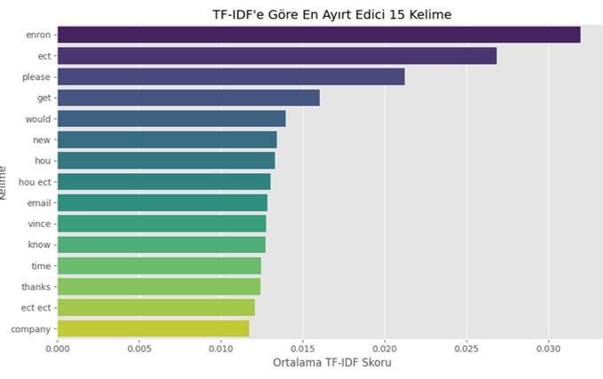
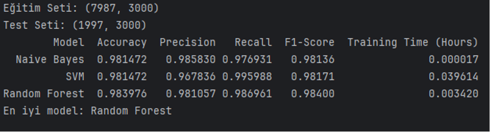
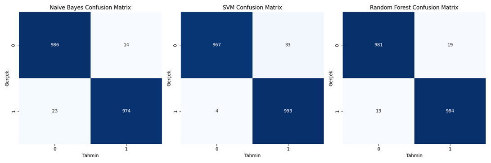
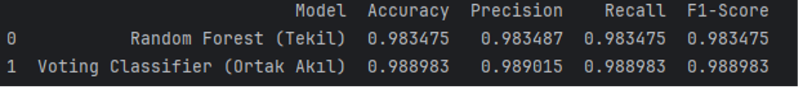
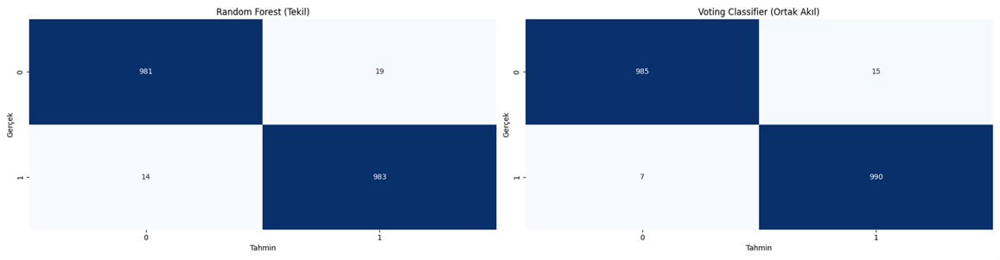
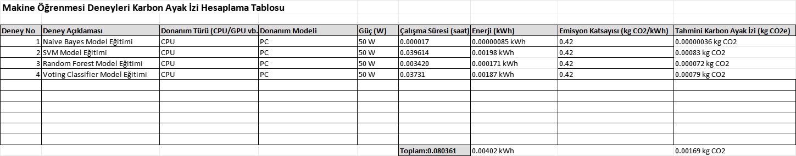

##📧 Email Spam Classification: A Modular ML Pipeline

This project implements a professional, multi-stage machine learning pipeline to classify emails as Spam or Ham (Normal). Utilizing advanced Natural Language Processing (NLP) and Ensemble Learning techniques, the system achieves a high accuracy rate while focusing on minimizing critical classification errors.

##🧐 Problem & Solution

Spam emails pose significant security risks and efficiency losses. Traditional rule-based filters often fail against evolving tactics. Our solution leverages Machine Learning to dynamically learn from data patterns, providing a robust and scalable defense mechanism.

##🚀 Pipeline Architecture

The project follows a modular "Pipeline" architecture to ensure scalability and maintainability:

1. Exploratory Data Analysis & Preprocessing
   
The first step involves cleaning the text data (HTML stripping, Regex filtering, Stopword removal) and identifying key terms using TF-IDF Vectorization. This allows the machine to understand the weight of specific words across the dataset.

2. Model Benchmarking
   
We compared three fundamental algorithms: Naive Bayes, SVM, and Random Forest. Each model was evaluated using Accuracy, Precision, Recall, and F1-Score metrics.

3. Error Analysis (Confusion Matrix)
   
In a spam filter, it is critical that legitimate emails are not accidentally blocked. We analyzed the Confusion Matrix of each base model to monitor False Positives.

##🧠 Advanced Methodology: Ensemble Learning

The core strength of this project is the Voting Classifier (Ensemble). By combining multiple models, we created a system that mitigates the weaknesses of individual algorithms.

The final model achieved a peak accuracy of 98.89%.

##🌿 Sustainability & Carbon Footprint

In line with modern engineering ethics, we regularly monitored the energy consumption of our model training process. This approach aims to maintain the environmental sustainability of our high-accuracy solution.

Our training process resulted in a total of 0.00169 kg CO2e emissions, demonstrating that high-accuracy AI can be achieved with minimal environmental impact.

##🛠️ Tech Stack

Language: Python

Environment: PyCharm

Libraries: Scikit-learn, Pandas, NumPy, Matplotlib, Seaborn

Key Methods: TF-IDF Vectorization, Voting Classifier (Ensemble Learning)

##How to Run

*Clone the repository to your local machine.

*Ensure you are using PyCharm or your preferred Python IDE.

*Install dependencies: pip install -r requirements.txt

*Run the main script to see the classification results and carbon footprint report.
